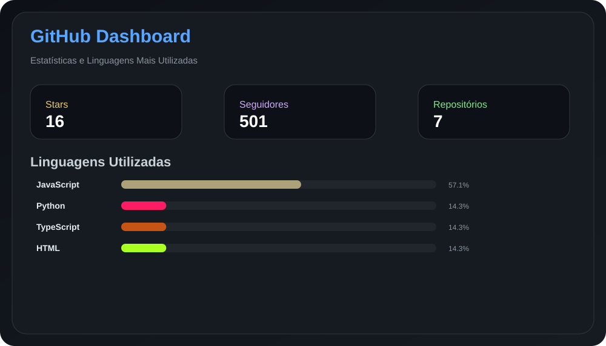

  

<h1 align="center">🌟 Rafaela Sommer Gonçalves 🌟</h1>

⚡💻 <b>Backend Developer • Engenharia da Computação • APIs • Sistemas Escaláveis</b>  

🚀 Construindo soluções eficientes, escaláveis e prontas para produção  

---

  

 

---

# 💼 Sobre mim

Sou estudante de **Engenharia da Computação (5º semestre)** com foco em **Desenvolvimento Backend** e **Arquitetura de Sistemas**.

Tenho experiência prática na criação de:

- APIs robustas e escaláveis  
- Sistemas integrados entre múltiplas plataformas  
- Automação de processos que reduzem esforço manual  
- Estruturas de código organizadas e de fácil manutenção  

💡 Meu foco é transformar problemas complexos em soluções simples, eficientes e prontas para escalar.

---

# 🎯 Objetivo

🚀 Buscando oportunidade de **estágio ou projetos em Backend / Engenharia de Software**, onde eu possa:

- Aplicar boas práticas reais de mercado  
- Evoluir tecnicamente com desafios reais  
- Contribuir com soluções eficientes desde o início  

---

# 🚀 O que eu entrego

✔ APIs REST bem estruturadas  
✔ Integração entre sistemas e serviços  
✔ Automação de rotinas e processos  
✔ Código limpo e organizado  
✔ Foco em performance e escalabilidade 

---

# 🛠️ Tecnologias e Ferramentas

## 💻 Linguagens

---

## 🏗️ Frameworks

---

## 🗄️ Bancos de Dados

---

<h1 align="center" style="color:#C77DFF;">
  🚀 Projetos em Destaque
</h1>

---

# 📊 Atividade no GitHub

---

# 📊 Dashboard

<!-- Dashboard gerado automaticamente -->

---

## 🤖 Atualização Automática do Perfil
<!--START_SECTION:dynamic-->

🕒 Última atualização: 03/07/2026 09:21:45

⏭ Próxima atualização: 03/07/2026 09:31:45

<!--END_SECTION:dynamic-->

---

<h2 align="center">📬 Contato</h2>

---

⭐ Se esse conteúdo te ajudou, deixe uma estrela no repositório!

