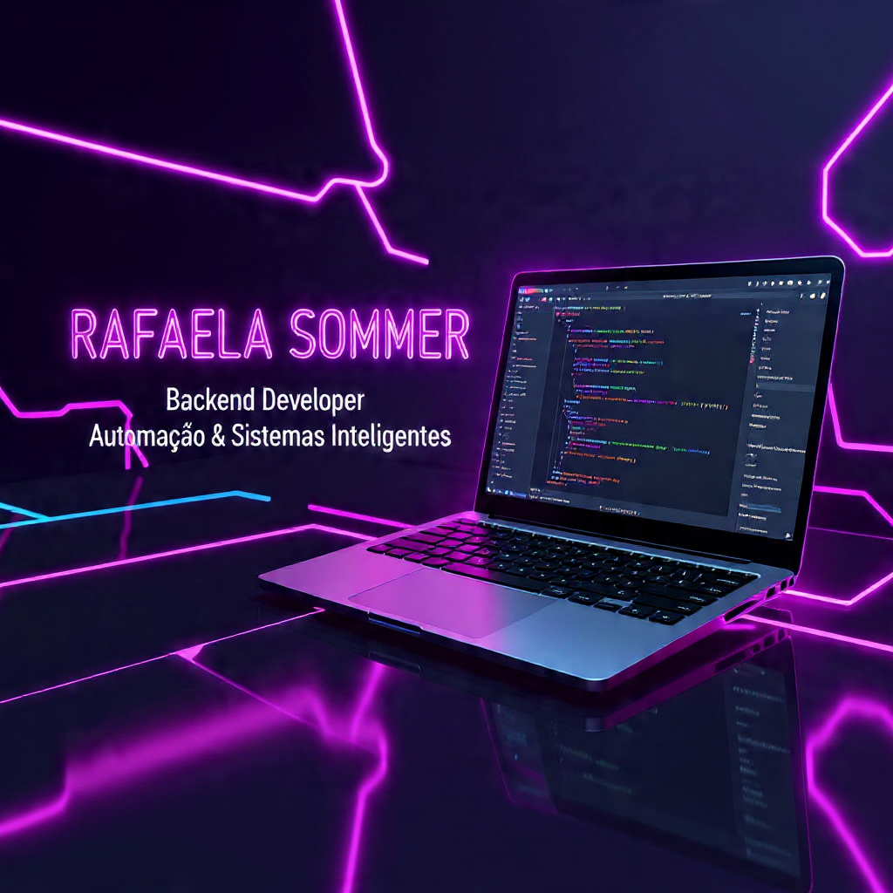

  

<h1 align="center">🌟 Rafaela Sommer Gonçalves 🌟</h1>

⚡💻 <b>Desenvolvedora Backend • Estudante de Engenharia da Computação • Arquitetura de Sistemas & Integração de APIs</b> ⚡  

---

  

---

# ✨ Sobre mim

Sou **Rafaela Sommer**, estudante de **Engenharia da Computação (5º semestre)** e **Desenvolvedora Backend** focada em criar **soluções inteligentes, escaláveis e bem arquitetadas**.

Tenho paixão por **automação, integrações entre sistemas e eficiência**, transformando processos complexos em **sistemas simples, rápidos e confiáveis**.

Trabalho sempre priorizando:

- **código limpo**
- **boas práticas de arquitetura**
- **alta performance**
- **manutenção e escalabilidade**

🎯 **Atualmente estou em busca de oportunidades de estágio ou projetos em Backend e Engenharia de Software.**

---

# 🚀 O que eu faço

- Desenvolvimento de **APIs REST**
- Criação de **microserviços escaláveis**
- **Automação de processos**
- **Integrações entre sistemas**
- Desenvolvimento de aplicações **seguras e performáticas**

💡 *Código limpo, arquitetura sólida e soluções que funcionam de verdade.*

---

# 🛠️ Tecnologias e Ferramentas

## 💻 Linguagens

---

## 🏗️ Frameworks

---

## 🗄️ Bancos de Dados

---

<h1 align="center" style="color:#C77DFF;">
  🚀 Projetos em Destaque
</h1>

---

# 📊 Atividade no GitHub

---

# 📊 Dashboard

<!-- Dashboard gerado automaticamente -->

---

## 🤖 Atualização Automática do Perfil
<!--START_SECTION:dynamic-->
## 🔄 Atualização Automática

🕒 Última atualização:  
19/03/2026 16:09:33 (Horário de Brasília)

🔁 Próxima atualização automática:  
19/03/2026 16:14:33 (Horário de Brasília)

📊 **Followers:** 348  
📦 **Projetos:** 9  
⭐ **Stars:** 7
<!--END_SECTION:dynamic-->

---

# 📬 Contato

---

⭐ Se esse conteúdo te ajudou, deixe uma estrela no repositório!

